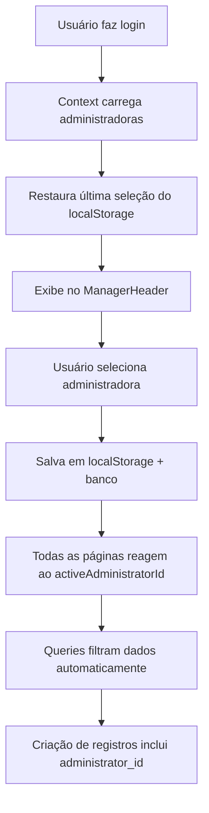

# Sistema de Multi-Contexto de Gestão

## 📋 Visão Geral

O sistema implementa um **modelo multi-contexto** onde cada **administradora** funciona como uma "camada de contexto" que define **o que o gestor pode ver, criar e editar** dentro da aplicação.

## 🎯 Conceito Principal

Quando um gestor seleciona uma administradora, ele está dizendo ao sistema:

> "Tudo o que eu fizer agora pertence a essa administradora."

Isso significa:
- ✅ Condomínios criados → pertencem à administradora selecionada
- ✅ Blocos, unidades, áreas comuns, veículos, pets, moradores → todos vinculados à mesma administradora
- ✅ Quando muda de administradora, o sistema filtra automaticamente todos os módulos

## 🏗️ Arquitetura Implementada

### 1. Context Global (`ManagerAdministradorasContext`)

**Localização:** `src/contexts/ManagerAdministradorasContext.tsx`

**Responsabilidades:**
- Gerencia a lista de administradoras do usuário
- Mantém a administradora ativa (`activeAdministrator`)
- Persiste a seleção em `localStorage` e no banco (campo `selected_administrator_id` do perfil)
- Fornece funções para trocar de administradora

**Estados principais:**
```typescript
const {
  administrators,           // Lista de administradoras do usuário
  activeAdministrator,      // Administradora selecionada
  activeAdministratorId,    // ID da administradora selecionada
  setActiveAdministratorId, // Função para mudar administradora
  selectAdministrator,      // Função alternativa (recebe objeto)
  handleSelect,             // Função para seleção por ID
  loading                   // Estado de carregamento
} = useManagerAdministradoras();
```

### 2. Persistência Multi-Nível

#### a) **localStorage**
```typescript
localStorage.setItem("activeAdministratorId", id);
```

#### b) **Banco de dados (profiles)**
```sql
UPDATE profiles 
SET selected_administrator_id = 'uuid-da-administradora'
WHERE id = 'user-id';
```

#### c) **Restauração automática**
O sistema restaura automaticamente a última administradora selecionada quando o usuário retorna ao app:

```typescript
useEffect(() => {
  const savedId = localStorage.getItem("activeAdministratorId");
  const { data: profileData } = await supabase
    .from("profiles")
    .select("selected_administrator_id")
    .eq("id", user.id)
    .single();
  
  // Prioriza localStorage, depois perfil do banco, depois primeira da lista
  const preferredId = savedId || profileData?.selected_administrator_id || administrators[0]?.id;
}, []);
```

### 3. Interface Visual (`ManagerHeader`)

**Localização:** `src/components/manager/ManagerHeader.tsx`

Exibe:
- Nome da administradora selecionada
- Dropdown para trocar entre administradoras
- Mensagem clara: "Administradora seleccionada"

```tsx
<Select
  value={activeAdministratorId}
  onValueChange={(value) => {
    const admin = administrators.find(a => a.id === value);
    if (admin) selectAdministrator(admin);
  }}
>
  <SelectTrigger>
    {activeAdministrator?.name}
  </SelectTrigger>
  <SelectContent>
    {administrators.map(admin => (
      <SelectItem key={admin.id} value={admin.id}>
        {admin.name}
      </SelectItem>
    ))}
  </SelectContent>
</Select>
```

## 🔍 Filtros por Administradora

### Hierarquia de Dados

```
administrators (administrator_id é a chave)
    ↓
condominiums (administrator_id)
    ↓
blocks (condominium_id)
    ↓
units (block_id)
    ↓
residents, vehicles, pets (unit_id)
```

### Exemplos de Queries

#### 1. **Condomínios** (filtro direto)
```typescript
const { data } = await supabase
  .from("condominiums")
  .select("*")
  .eq("administrator_id", activeAdministratorId);
```

#### 2. **Blocos** (filtro via join)
```typescript
const { data } = await supabase
  .from("blocks")
  .select(`
    *,
    condominiums!inner(name, administrator_id)
  `)
  .eq("condominiums.administrator_id", activeAdministratorId);
```

#### 3. **Unidades** (filtro via join duplo)
```typescript
const { data } = await supabase
  .from("units")
  .select(`
    *,
    blocks!inner(name),
    condominiums!inner(name, administrator_id)
  `)
  .eq("condominiums.administrator_id", activeAdministratorId);
```

#### 4. **Áreas Comuns** (com lógica de plano)
```typescript
let query = supabase
  .from("common_areas")
  .select(`
    *,
    condominiums!inner(name, administrator_id)
  `);

// No plano pago, filtra por administradora
if (!isFreePlan && activeAdministratorId) {
  query = query.eq("condominiums.administrator_id", activeAdministratorId);
}
```

## 📝 Criação de Registros

Sempre inclua o `administrator_id` ao criar condomínios:

```typescript
await supabase
  .from("condominiums")
  .insert({
    name: nome,
    address: endereco,
    administrator_id: activeAdministratorId, // ✅ Essencial!
  });
```

Para blocos e unidades, o vínculo é automático via `condominium_id` e `block_id`.

## 🎨 Feedback Visual

### 1. **Indicador de Contexto**
```tsx
{activeAdministrator && (
  <Badge variant="outline">
    {activeAdministrator.name}
  </Badge>
)}
```

### 2. **Fallback quando não há administradora**
```tsx
if (!activeAdministratorId) {
  return (
    <ManagerLayout>
      <div className="p-6 text-center text-gray-500">
        Selecione uma administradora para visualizar os condomínios.
      </div>
    </ManagerLayout>
  );
}
```

### 3. **Loading State**
```tsx
{loading ? (
  <Skeleton className="h-9 w-60" />
) : (
  <Select value={activeAdministratorId}>
    {/* ... */}
  </Select>
)}
```

## ⚡ Reatividade

O sistema reage automaticamente às mudanças:

```typescript
useEffect(() => {
  if (activeAdministratorId) {
    fetchCondos(); // Recarrega dados automaticamente
  }
}, [activeAdministratorId]);
```

## 🔐 Segurança

### Row Level Security (RLS)

As policies do Supabase garantem que:
- Gestores só veem administradoras onde `user_id` ou `responsible_id` = seu ID
- Condomínios só aparecem se pertencerem a essas administradoras
- Cascata de segurança através de foreign keys

### Validação no Frontend

```typescript
if (!activeAdministratorId) {
  showRadixError("Aguarde o carregamento das informações da administradora");
  return;
}
```

## 🚀 Benefícios

1. **Gestão Isolada**: Cada administradora tem seus próprios dados, sem mistura
2. **Escalabilidade**: Fácil transformar em SaaS multi-tenant (cada administradora = empresa)
3. **UX Clara**: Usuário sempre sabe em qual contexto está trabalhando
4. **Performance**: Queries otimizadas com filtros eficientes
5. **Persistência**: Contexto mantido entre sessões

## 📦 Componentes Principais

| Componente | Responsabilidade |
|------------|------------------|
| `ManagerAdministradorasContext` | Gerencia estado global de administradoras |
| `ManagerHeader` | Exibe e permite trocar administradora |
| `Condominios.tsx` | Filtra e cria condomínios por administradora |
| `Blocos.tsx` | Filtra blocos via join com condominiums |
| `Unidades.tsx` | Filtra unidades via join com condominiums |
| `AreasComuns.tsx` | Filtra áreas comuns (com lógica de plano) |
| `Vehiculos.tsx` | Filtra veículos via join com condominiums |

## 🔄 Fluxo Completo



## 🛠️ Manutenção

### Adicionar novo módulo com filtro:

1. Importe o contexto:
```typescript
import { useManagerAdministradoras } from "@/contexts/ManagerAdministradorasContext";
```

2. Use o activeAdministratorId:
```typescript
const { activeAdministratorId } = useManagerAdministradoras();
```

3. Filtre as queries:
```typescript
.eq("administrator_id", activeAdministratorId) // Filtro direto
// ou
.eq("condominiums.administrator_id", activeAdministratorId) // Filtro via join
```

4. Reaja às mudanças:
```typescript
useEffect(() => {
  if (activeAdministratorId) {
    fetchData();
  }
}, [activeAdministratorId]);
```

---

**Última atualização:** 8 de novembro de 2025
